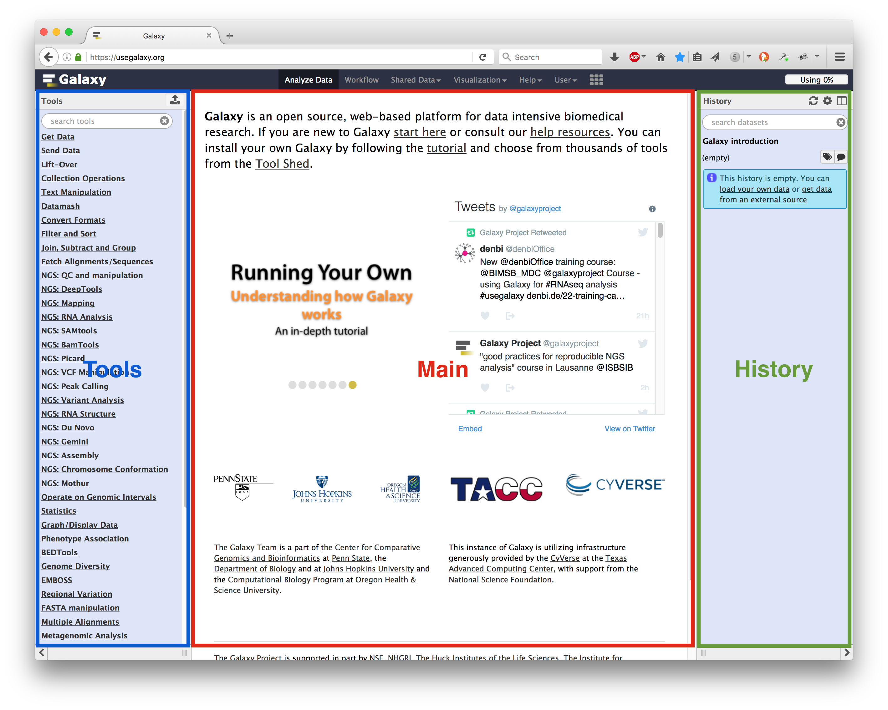

Intro to Galaxy
===========================

Lecture
^^^^^^^

.. slide:: https://docs.google.com/presentation/d/1utmzx1UKoBUxOwN32NFH86_DA_J7XA8D

Introduction
^^^^^^^^^^^^

In this practical you will learn to import and assess the quality of raw high throughput sequencing sequencing data in Galaxy.

Here, we will perform virus discovery on a Tomato leaf sample. The dataset was generated using the SQK-PCS108 cDNA PCR kit (Oxford Nanopore Technologies) and sequenced in a MinION Mk1B device (MIN-101B).

Login to Galaxy
^^^^^^^^^^^^^^^
We will be using Galaxy for performing many of our bioinformatic analyses. This is a great free tool for performing bioinformatics, no coding necessary! There are lots of tutorials available online, both on how to use Galaxy and perform specific analysis. See training materials at link below on your own time.

https://training.galaxyproject.org/training-material/

.. admonition:: Hands-On: Login

    1. Open your favorite web browser (Chrome, Safari, or Firefox--not Internet Explorer) and login to Galaxy Europe. If not already registered for Galaxy Europe, use this link to register and login:

    https://usegalaxy.eu/

     .. image:: _static/galaxylogin.png

The Galaxy homepage is divided into three panels:

- Tools on the left
- Viewing panel in the middle
- History of analysis and files on the right

Name History
^^^^^^^^^^^^

.. admonition:: Hands-On: Name History

    1. Go to history panel (on the right)

    2. Click on the history name (which by default is “Unnamed history”)

    .. image:: _static/rename_history.png

    3. Type in a new name,  “NPDN Day 1”

    4. Press Enter on your keyboard to save it.

Import Data
^^^^^^^^^^^
Lets import data from a shared history. These are raw reads, exactly how you would receive them from a sequencing company or off your own Nanopore sequencer with on-board basecalling enabled.

.. admonition:: Hands-On: Import Viral Metagenomic Reads

    1. At the top of the screen click on ``Shared Data`` and select ``Histories``

    2. In the search field, search for ``NPDN 2024``

    3. Find the history for ``NPDN 2024 3G Virus Data`` Select the green plus sign to import into your Galaxy environment.

Sequence QC
^^^^^^^^^^^^^
The first step in any sequencing analysis is quality check and trimming. These sequences have already been based called with on-board base calling and this is how you would receive them off of the sequencer. Let's first check the quality of the data we received.

.. admonition:: Hands-On: Quality Check

	1. In tools menu, search for 'Nanoplot' and click on it.

	2. Run Nanoplot tool with the following parameters

		* “files”: ``virus_3g.fastq.gz``

		* Leave the rest as default.

	3. Click Run Tool.

Nanoplot should produce four output files. Let's take a look at the html output report.

-------------------------

.. container:: toggle

	.. container:: header

		**How many reads are in this dataset?**

	This sample should have 20,000 reads. (I sub-sampled the reads to this number so that programs would run in a reasonable amount of time. Originally, there were over 3 million reads!). If you would like to compare results from a full run versus the subsampled run on your own time the SRA accession number for the full dataset is SRR11794480.

----------------------------

Quality Filtering
^^^^^^^^^^^^^^^^^^^
Many of the reads appear to have  low quality bases. Let's filter the data to remove adapters, chimeric reads, and low quality bases. First we will filter to retain only high-quality long reads. Quality filtering is a balancing act to retain enough high-quality reads for analysis. Here, we will set a minimum length for reads to maintain. We will also only keep the top 20% of high quality reads. This will help our analysis run faster, you may also set a minimum quality threshold. Please play with filtering on your own time to see how this impacts analysis.

.. admonition:: Hands-On: Quality Filtering

    1. In tools menu, search for 'Filtlong' and click on it.

    2. Run Filtlong tool with the following parameters

      * Input Fastq: ``virus_3g.fastq.gz``

      * Output Theshholds:

          - Keep Percentage: ``20``

          - Min Length: ``1000``

      * Leave the rest as default.

    3. Click Run Tool.

Now we will remove any adapters left over after sequencing.

.. admonition:: Hands-On: Adapter Trimming

    1. In tools menu, search for 'porechop' and click on it.

    2. Run porechop tool with the following parameters

      * Input Fastq: ``filtlong output``

      * Output Format for the Reads: ``fastq.gz``

      * Leave the rest as default.

    3. Click Run Tool.

Porechop should produce a new fastq file with adapter and chimeric reads removed.

Convert Analysis into a Workflow
^^^^^^^^^^^^^^^^^^^^^^^^^^^^^^^^

When you look at your history, you can see that it contains all the steps of our analysis, from the beginning (at the bottom) to the end (on top). The history in Galaxy records details of every tool you run and preserves all parameter settings applied at each step. But when you need to analyze new data, it would be tedious to do each step one-by-one again. Wouldn’t it be nice to just convert this history into a workflow that we will be able to execute again and again?

Galaxy makes this very easy with the Extract workflow option. This means any time you want to build a workflow, you can just perform the steps once manually, and then convert it to a workflow, so that next time it will be a lot less work to do the same analysis.

.. admonition:: Hands-On: Create a Seq QC Workflow

    1. Clean up your history: remove any failed (red) jobs from your history. This will make the creation of the workflow easier.

    2. Click on galaxy-history-options (History options) at the top of your history panel and select Extract workflow.

    .. image:: _static/extractworkflow.png

    The central panel will show the content of the history in reverse order (oldest on top), and you will be able to choose which steps to include in the workflow.

    .. image:: _static/extractworkflow2.png

    3. Replace the Workflow name to something more descriptive, for example: ``MinION Read QC``

    4. Rename the workflow input in the box at the top of second column to: ``Reads``

    5. Click on the Create Workflow button near the top.

Create a New History
^^^^^^^^^^^^^^^^^^^^^^^^^^^^^^^^
Let’s create a new history so that we can test out our new workflow and run some QC on the full dataset.

.. admonition:: Hands-On: Create a New History

    1. Create a new history

    .. image:: _static/createnewhis.png

    2. Rename your history to ``NPDN 2024 3G Virus Full Tomato``

Upload Data from SRA
^^^^^^^^^^^^^^^^^^^^^^^^^^^^^^^^
Here we will import the full run from the reads we ab from NCBIs SRA database.

.. admonition:: Hands-On: Import Data from SRA

    1. In the tools panel search for ``Faster Download and Extract Reads in FASTQ`` and click on it

    2. Enter this Accession: SRR11794480

    3. Click ``Run tool``

    4. Several collections are created in your history panel when you submit this job:

        * Paired-end data (fasterq-dump); Contains Paired-end datasets (if available)

        * Single-end data (fasterq-dump); Contains Single-end datasets (if available)

        * Other data (fasterq-dump); Contains Unpaired datasets (if available)

        * fasterq-dump log; Contains information about the tool execution

Once fasterq finishes transferring the data explore the collections created by clicking on the collection name in the history panel. You should see in the single-end data collection there is a dataset of reads. This is what we will be analyzing. You can delete the other 3 empty collections.

Run a Workflow
^^^^^^^^^^^^^^^
Lets run our quality control pipeline on our newly downloaded dataset.

.. admonition:: Hands-On: Run A Workflow

    1. Click on Workflow in the top menu bar of Galaxy. Here you have a list of all your workflows. Your newly created workflow should be listed at the top:

    .. image:: _static/selectworkflow.png

    2. Click on the Run workflow button next to your workflow. The central panel will change to allow you to configure and launch the workflow.

    .. image:: _static/selectworkflow2.png

    3. Click on the Browse datasets icon on the right of each input box. For Reads input select the read file you just downloaded.

    4. Select Run Workflow.

Examine the output from the workflow as it finishes.
